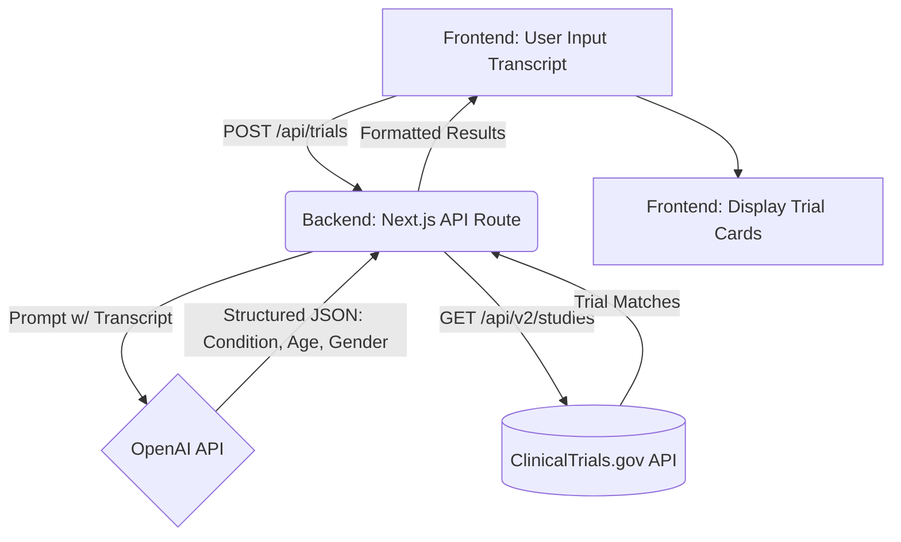

# DeepScribe Clinical Trials Matcher

A full-stack application that analyzes patient-doctor transcripts using AI to extract key clinical parameters and instantly matches them with actively recruiting trials from ClinicalTrials.gov.

## Overview of Approach

1. **Frontend**: Built with Next.js (App Router), TypeScript, and Tailwind CSS. The UI is designed to be a clean, split-pane dashboard that immediately shows the value of the application without requiring complex navigation.
2. **Backend**: A Next.js API Route handles the orchestration between the LLM and the ClinicalTrials API.
3. **AI Extraction**: Uses the OpenAI Node SDK with **Structured Outputs** (`zod` schema) to guarantee the model returns strongly-typed JSON containing the condition, age, and gender.
4. **Data Fetching**: Queries the ClinicalTrials.gov v2 API, using the extracted condition and demographic keywords to find relevant, actively recruiting studies.

## Architecture & Data Flow



## Deployed Demo

[View Live Demo](https://deepscribe-five.vercel.app)

## Setup & Running Locally

### Prerequisites
- Node.js (v18.17 or higher)
- npm
- An OpenAI API key

### Steps

1. **Clone the repository**
   ```bash
   git clone <repo-url>
   cd deepscribe
   ```

2. **Install dependencies**
   ```bash
   npm install
   ```

3. **Configure Environment Variables**
   Create a `.env.local` file in the root directory and add your OpenAI API key:
   ```bash
   OPENAI_API_KEY=your_openai_api_key_here
   ```

4. **Start the development server**
   ```bash
   npm run dev
   ```

5. **Open the app**
   Visit [http://localhost:3000](http://localhost:3000) in your browser.

## Assumptions Made

- **API Version**: The project utilizes the `ClinicalTrials.gov v2 API`, as the legacy API has been retired.
- **LLM Selection**: The application defaults to `gpt-5.2`. It provides excellent performance, low latency, and cost-efficiency for entity extraction with Structured Outputs.
- **Demographic Filtering**: The ClinicalTrials v2 API's `query.term` parameter is used to pass age and gender data to provide flexible, text-based matching in addition to the strict `query.cond` parameter. We also strictly filter by `RECRUITING` status to only show actionable trials.

## Craftsmanship Highlights

Here are three areas of the project I paid special attention to:

1. **Robust LLM Extraction via Structured Outputs**
   Prompt engineering is only half the battle; ensuring the application doesn't break due to malformed JSON is critical. By combining `zod` schemas with OpenAI's `zodResponseFormat`, the backend guarantees that the response conforms strictly to our TypeScript interfaces (`condition`, `age`, and `gender`). This eliminates parsing errors and provides end-to-end type safety.

2. **Refined User Experience (UX)**
   The interface features a "Load Sample Transcript" button to instantly demonstrate value. The split-pane layout keeps the user's context (the transcript) visible while the results load on the right. Loading states use smooth transitions and clear iconography (`lucide-react`) to maintain a polished, professional feel.

3. **Optimized API Integration**
   When querying the ClinicalTrials API, the application specifically limits the returned payload by requesting only necessary fields (`fields=NCTId,BriefTitle,OverallStatus,Conditions,EligibilityModule`). This dramatically reduces the payload size and decreases latency, ensuring the application remains snappy even when aggregating external AI and public data services.

## Future Improvements (Production Readiness)

While this application fulfills the core requirements, a production-grade system would require the following architectural enhancements:

1. **API Security & Rate Limiting**: The `/api/trials` endpoint is currently unprotected. In production, this route would be secured behind authentication (e.g., NextAuth/Clerk) and rate-limited (e.g., via Redis/Upstash) to prevent abuse and protect OpenAI API quotas.
2. **Comprehensive Automated Testing**: A mature CI/CD pipeline would include unit tests for the extraction logic (mocking the OpenAI responses) and integration tests for the ClinicalTrials API fetching using frameworks like Jest or Vitest.
3. **Configurable Prompt Management**: The system prompt is currently hardcoded in the API route. In an enterprise system, prompts should be decoupled from the codebase—managed via an external CMS or Prompt Management tool (like Langfuse or Braintrust)—allowing non-technical domain experts to iterate on prompt engineering without requiring a full deployment.
